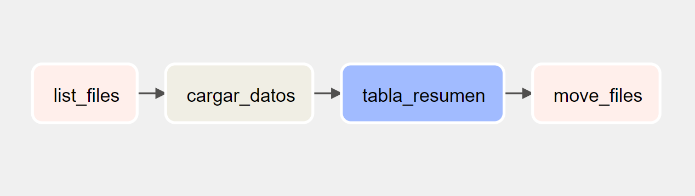
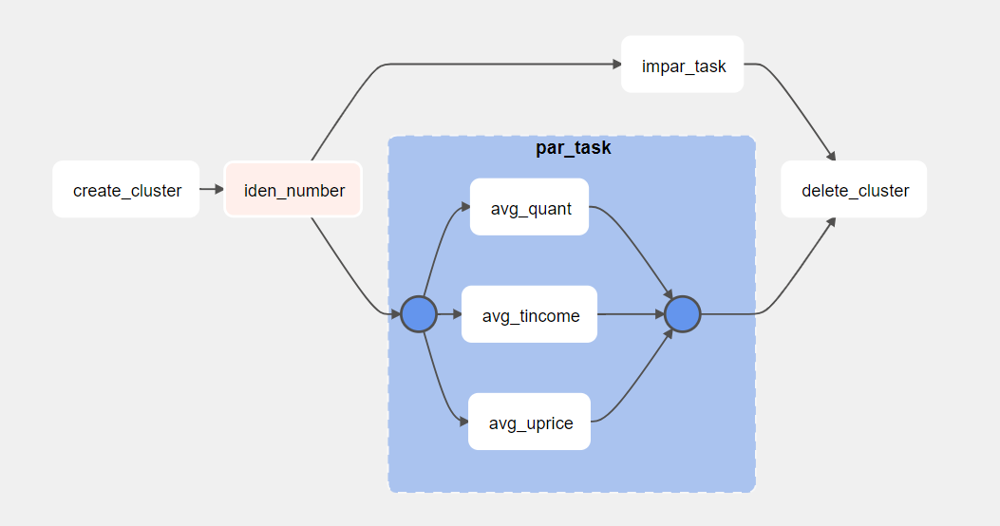

# Orquestando servicios de GCP con Apache Airflow

Dos ejercicios básicos que demuestran cómo podemos orquestar diferentes servicios de Google Cloud a través de la tecnología [Apache Airflow](https://airflow.apache.org/).

En el repositorio se encuentran dos [DAGs](scripts):
1. **GCStorage_BigQuery_Dag.py**: extrae datos raw desde Google Cloud Storage y los convierte en una tabla de BigQuery con transformaciones. Los objetos en raw son movidos a un bucket temporal.

2. **Dataproc_PySparkJob_Dag.py**: el DAG implementa un cluster de Dataproc y ejecuta un trabajo ETL con Spark (Python API): extrae datos desde GCS con una operación de lectura, luego realiza transformaciones simples, genera escritura sobre un dataset de BigQuery y elimina automáticamente el cluster de Dataproc.

### Nota:
*Instalación de Airflow 2.1.3 en Ubuntu (WSL2) con virtual environment de Conda.*